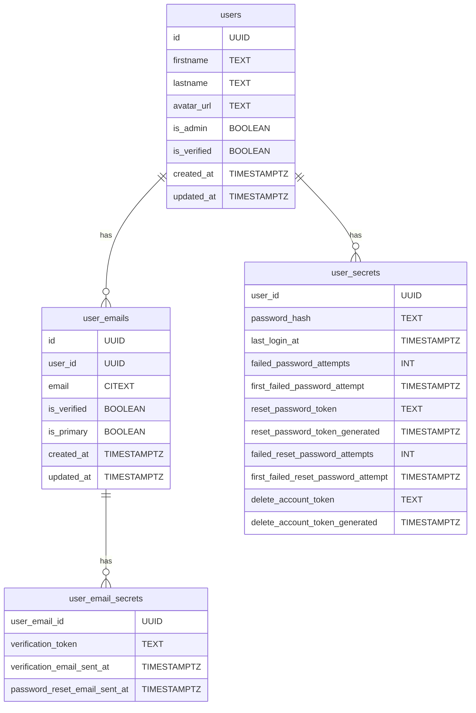

# Les utilisateurs de l'application

Le projet est une plateforme destinée à être utilisé par des utilisateurs connectés, que nous appelons `Users`. De manière générale, chaque utilisateur renseigne un certain nombre d'informations personnelles, qui permettent de l'identifier sur la plateforme, ainsi que les emails qu'il souhaite utiliser pour accéder à la plateforme.

