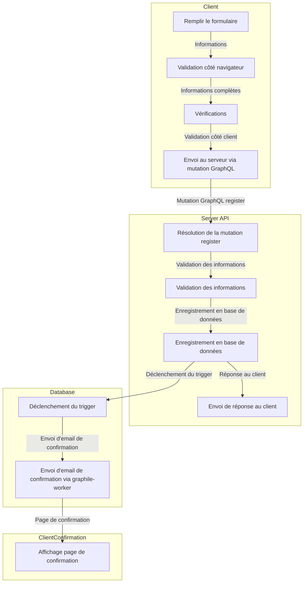

import { Callout, Steps } from "nextra/components";

# Création d'un compte utilisateur

Sur la plateforme, tout visiteur à la possibilité de créer un compte. Il est à noter que ce compte ne trouvera une utilité qu'une fois l'utilisateur relié à une organisation, sujet abordé par la suite.

## Étapes lors de la création d'un compte

<Steps>
### le visiteur est invité à remplir un formulaire avec les informations suivantes :
  - nom
  - prénom
  - email
  - mot de passe
  - confirmation du mot de passe
### Validation formulaire côté navigateur
Le formulaire est validé côté navigateur. On indique au visiteur que les information squ'il a renseignées sont complètes, et on s'assure que l'email qu'il utilise n'est pas déjà utilisé par un autre compte qui aurait été validé.
  - vérification que les champs obligatoires sont renseignés,
  - vérification que l'email est valide,
  - vérification que l'email n'est pas déjà utilisé par un autre compte,
  - vérification que les mots de passe correspondent,
  - vérification que le mot de passe est suffisamment sécurisé.
### Appel API
envoi du formulaire au serveur API via la mutation graphQL `register`
### Pesistance en BDD
le resolver de cette mutation valide les informations de l'utilisateur et enregistre le compte en base de données via l'emploi de procédures stockées dans la BDD PostgreSQL. (plus d'informations sur la mutation plus bas)
### Réponse API

    - si la procédure stockée a bien été exécutée, le serveur API renvoie une réponse au client sous forme de boolean.
    - si la procédure stockée n'a pas été exécutée, le serveur API renvoie une réponse au client avec un message d'erreur.

### Envoi d'email de confirmation

Si la procédure stockée a bien été exécutée, un trigger est déclenché en base de données. Ce trigger envoie un email de confirmation à l'utilisateur via graphile-worker.

### Redirection vers la page de confirmation

l'utilisateur arrive sur une page confirmant la création de son compte et lui indiquant qu'il doit valider son compte via le lien qu'il a reçu par email.

</Steps>



## Mutation GraphQL `register`

A l'aide d'un plugin Postgraphile (`/plugins/auth-plugin.ts`), on ajoute une mutation GraphQL `register` qui permet de créer un compte utilisateur. Le resolver appelle la fonction `priv.really_create_user` qui est une procédure stockée en base de données. Cette procédure stockée permet de créer un compte utilisateur en base de données. Elle pourra aussi être utilisée dans des scénarios d'OAuth.

```sql
create function priv.really_create_user(
  email text,
  email_is_verified bool,
  firstname text,
  lastname text,
  avatar_url text,
  password text default null
) returns publ.users as $$
declare
  v_user publ.users;
begin
  if password is not null then
    perform priv.assert_valid_password(password);
  end if;
  if email is null then
    raise exception 'Email is required' using errcode = 'MODAT';
  end if;

  -- Insert the new user
  insert into publ.users (firstname, lastname, avatar_url) values
    (firstname, lastname, avatar_url)
    returning * into v_user;

	-- Add the user's email
  insert into publ.user_emails (user_id, email, is_verified, is_primary)
  values (v_user.id, email, email_is_verified, email_is_verified);

  -- Store the password
  if password is not null then
    update priv.user_secrets
    set password_hash = crypt(password, gen_salt('bf'))
    where user_id = v_user.id;
  end if;

  -- Refresh the user
  select * into v_user from publ.users where id = v_user.id;

  return v_user;
end;
$$ language plpgsql volatile set search_path to pg_catalog, public, pg_temp;

comment on function priv.really_create_user(email text, email_is_verified bool, firstname text, lastname text, avatar_url text, password text) is
  E'Creates a user account. All arguments are optional, it trusts the calling method to perform sanitisation.';

```

Dans le cas où le plugin reçoit confirmation que la procédure stockée a bien été exécutée, il renvoie une réponse au client sous forme de boolean. Dans le cas contraire, il renvoie une réponse au client avec un message d'erreur.

<Callout type="info" emoji="ℹ️">
  Cette procédure peut être modifié pour renvoyer un token et ainsi
  authenmtifier l'utilisateur directement après la création de son compte. Le
  parti pris sur ce projet est d'empecher la navigation sur la plateforme pour
  les comptes non validés.
</Callout>
<Callout type="info" emoji="ℹ️">
  On note dans la procédure que le MdP peut être null. En KeyframeEffect, cette
  même procédure peut être utilisée pour créer un compte utilisateur via OAuth.
  Dans ce cas, le mot de passe n'est pas nécessaire. Cette fonctionalité n'est
  pas développée dans le cadre de ce projet.
</Callout>
